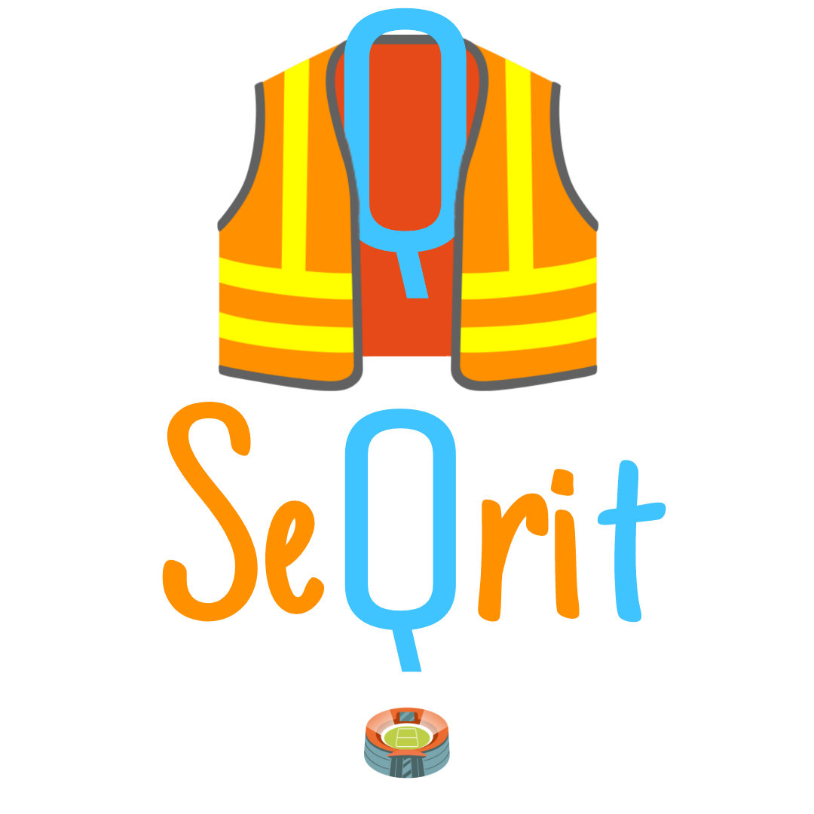

# SeQrit

    

  Università degli Studi di Padova
     
  Dipartimento di Matematica "Tullio Levi-Civita"
     
  Programmazione ad Oggetti 2022/2023

  Applicazione per la gestione del personale addetto alla sicurezza di eventi
    
  Interfaccia grafica in Qt, scritto in C++

